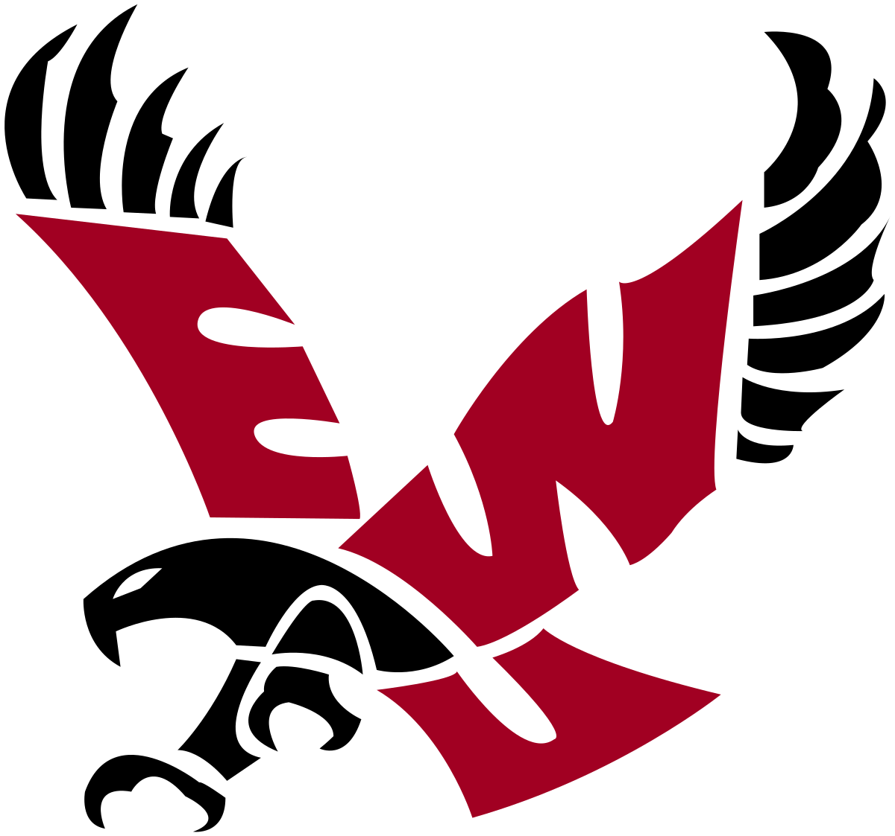

<!--To DO
Cover image
Better greeting
Pudgie image
-->
# Welcome
## On GitHub I am...
...participating in a *Microsoft Leap Internal Program* and brushing up on 5+ years of missed codeing. So far GitHub is how I remember it but HTML and Markdown are new to me. Excited for C# and where this all will lead. React Js was a unxpected challange but one I am up for!

## I Enjoy:
- Being a part of solutions
- Finding creative resolutions to problems
- Taking time to think before I put in my 2 cents
- Spending time with my family, riding motorcycles, working on classic cars, hiking, target shooting, video games and driving my wife **slowly** over the edge.

## Professional

### Intern at *Microsoft Leap*
Currently participating in a *Microsoft Leap Internal Program* to enhance my coding skills and hopefully lead to a position in software engineering. 

**Eastern Washington Unversity**, Bachelor of Science in Computer Science-2016
#

### Contact
- https://www.linkedin.com/in/steven-mather-1a973a101
- StevenRMather@gmail.com

<!--Add good bye or pudgie Image-->

<!--
**StMather/StMather** is a ✨ _special_ ✨ repository because its `README.md` (this file) appears on your GitHub profile.

Project objectives
-Demonstrate comprehension of markdown syntax through -implementing all project requirements
-Learn through reading documentation (in this case, reading markdown documentation)
-Clone and manage a local git repository
-Make commits with atomic commit messages
-Push changes to remote repository

Project requirement
{}
-/Make a minimum of four commits (Recommend making at least one commit for each profile section).
-/Use four heading tags (Hint: # Creates an H1 heading).
-/Have bold text
-/Have italic text
-/Make a list
-/Add a link to your LinkedIn profile
-/Add an image (The image may be of anything--your cat, an icon, etc.).
}
-Project outline
-Your profile page should have these sections.
{
--I’m currently learning or On GitHub I am
---Discuss the reason(s) you are on GitHub.
--I enjoy
---Talk about your interests--technical or non-technical
--Professional
---List at least one professional experience or position that relates to coding. Keep this section brief. You may get inspiration from your LinkedIn profile page.
}
Project notes
-In this project you do not need to create multiple branches. You may make changes to the main branch and push changes from your local main branch to the remote main branch. Using multiple branches is optional.
-You will be revisiting your GitHub profile page and making updates after this week. On the one hand, make your profile page presentable. On the other hand, don't spend too much time on the markdown file.
-The most challenging part of this project may be including an image. You may experiment or ask others for help in including an image.
-->
